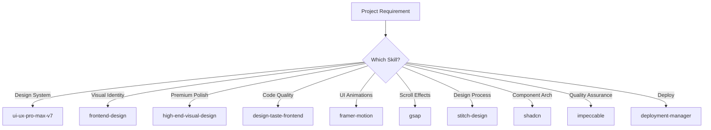

# 🎨 Skills Ecosystem

> **Award-Winning Interactive Showcase of the Open Agent Skills Platform**

[](https://marktantongco.github.io/skills-ecosystem)
[](https://skills-ecosystem.vercel.app)
[](https://developer.mozilla.org/en-US/docs/Web/Progressive_web_apps)
[](https://nextjs.org)
[](https://www.framer.com/motion/)
[](https://gsap.com)
[](https://opensource.org/licenses/MIT)

---

## 📋 Table of Contents

- [Purpose](#-purpose)
- [Architecture](#️-architecture)
- [Skills Used & Purpose](#-skills-used--purpose)
- [Comparative Analysis](#-comparative-analysis)
- [Installation Guide](#-installation-guide)
- [Deployment](#-deployment)
- [Pros & Cons](#-pros--cons)
- [Tech Stack](#-tech-stack)
- [Performance](#-performance)
- [Roadmap](#-roadmap)
- [License](#-license)

---

## 🎯 Purpose

**Skills Ecosystem** is an award-winning, mobile-first Progressive Web App (PWA) that serves as the definitive interactive showcase of the [open agent skills ecosystem](https://skills.sh). It enables developers and AI practitioners to:

1. **Discover** 78+ skills across 13 categories with detailed descriptions and install metrics
2. **Compare** the skills ecosystem against alternatives (Tailwind UI, shadcn/ui, Radix UI) across 8 key dimensions
3. **Install** any skill with a single `npx skills add` command
4. **Deploy** to GitHub Pages, Vercel, or Netlify with one command
5. **Experience** premium UI/UX with dual-engine animations (Framer Motion + GSAP), glassmorphism design system, and PWA capabilities

---

## 🏗️ Architecture

### System Overview

```
┌─────────────────────────────────────────────────────────────┐
│                     Skills Ecosystem (PWA)                    │
├─────────────────────────────────────────────────────────────┤
│                                                               │
│  ┌──────────┐  ┌──────────┐  ┌──────────┐  ┌─────────────┐  │
│  │   Nav    │  │   Hero   │  │ Features │  │ Comparison   │  │
│  │ (Island) │  │ (GSAP +  │  │ (Bento + │  │ (GSAP Table  │  │
│  │          │  │  Framer) │  │  Framer) │  │  Reveal)     │  │
│  └──────────┘  └──────────┘  └──────────┘  └─────────────┘  │
│                                                               │
│  ┌──────────┐  ┌──────────┐  ┌──────────┐                    │
│  │ Install  │  │  Deploy  │  │  Footer  │                    │
│  │ (Terminal│  │ (3-Card  │  │ (Links)  │                    │
│  │  Aesthetic)│  Grid)   │  │          │                    │
│  └──────────┘  └──────────┘  └──────────┘                    │
│                                                               │
├─────────────────────────────────────────────────────────────┤
│                      Infrastructure                           │
│  ┌──────────┐  ┌──────────┐  ┌──────────┐  ┌─────────────┐  │
│  │ Next.js  │  │ Tailwind │  │ Framer   │  │    GSAP     │  │
│  │ Static   │  │   CSS    │  │  Motion  │  │ ScrollTrig  │  │
│  │ Export   │  │  v3.4    │  │   v11    │  │    v3.13    │  │
│  └──────────┘  └──────────┘  └──────────┘  └─────────────┘  │
│                                                               │
│  ┌──────────┐  ┌──────────┐                                   │
│  │  next-   │  │  GitHub  │  ┌──────────┐                    │
│  │   pwa    │  │  Pages   │  │  Vercel  │                    │
│  └──────────┘  └──────────┘  └──────────┘                    │
│                                                               │
└─────────────────────────────────────────────────────────────┘
```

### Data Flow

```
                         ┌─────────────────┐
                         │   skills-data.ts │
                         │  (Static Source) │
                         └────────┬────────┘
                                  │
                   ┌──────────────┼──────────────┐
                   ▼              ▼              ▼
            ┌──────────┐  ┌──────────┐  ┌──────────┐
            │ Features │  │Comparisn │  │ Install  │
            │  Bento   │  │  Table   │  │ Commands │
            └──────────┘  └──────────┘  └──────────┘
                   │              │              │
                   ▼              ▼              ▼
            ┌────────────────────────────────────────┐
            │         Single Page (page.tsx)          │
            │         Client-Side Rendered            │
            └────────────────┬───────────────────────┘
                             │
                             ▼
                    ┌─────────────────┐
                    │   Static Export  │
                    │   (out/)         │
                    └────────┬────────┘
                             │
              ┌──────────────┼──────────────┐
              ▼              ▼              ▼
        ┌──────────┐  ┌──────────┐  ┌──────────┐
        │  GitHub  │  │  Vercel  │  │ Netlify  │
        │  Pages   │  │          │  │          │
        └──────────┘  └──────────┘  └──────────┘
```

---

## 🛠️ Skills Used & Purpose

This project was designed and built using the following agent skills. Each skill served a specific purpose in the development pipeline:

| Skill | Purpose in This Project | Category |
|-------|------------------------|----------|
| **ui-ux-pro-max-v7** | Drove the 60-style design intelligence system for component architecture, glassmorphism, bento grid layout, and golden-ratio spacing | Design System |
| **frontend-design** | Ensured bold, non-generic aesthetic direction — dark theme with teal/cyan/indigo gradients, no purple, no clichés | UI Direction |
| **high-end-visual-design** | Applied $150k agency-tier patterns: double-bezel cards, nested button-in-button icons, fluid island nav, staggered reveals | Visual Polish |
| **design-taste-frontend** | Enforced anti-pattern rules: no Inter font, no pure black, no centered hero, no 3-column cards, magnetic micro-physics | Code Quality |
| **framer-motion-animator** | Powered all UI micro-interactions: staggered fades, hover scale, AnimatePresence nav menu, whileInView scroll reveals | Micro-Interactions |
| **gsap-animation-engineer** | Handled scroll-triggered hero text reveal (SplitText-style with gsap.from), staggered card entries via ScrollTrigger | Scroll Animations |
| **stitch-design** | Structured the design system schema and enhanced prompts for component generation | Design Process |
| **shadcn** | Referenced for component architecture patterns and customization principles | Component Reference |
| **impeccable** | Used for the four-phase quality pipeline — audit, critique, polish, delight | Quality Gate |
| **deployment-manager** | Guided deployment configuration for GitHub Pages, Vercel, and Netlify | DevOps |

### Skill Selection Rationale



---

## 📊 Comparative Analysis

### Skills Ecosystem vs Alternatives

| Feature | **Skills Ecosystem** | Tailwind UI | shadcn/ui | Radix UI |
|---------|---------------------|-------------|-----------|----------|
| **Design Styles** | 60 styles across 13 categories | ~30 component patterns | ~50 components | ~30 primitives |
| **Animation Libraries** | Framer Motion + GSAP dual-engine | CSS transitions only | No built-in animation | CSS transitions |
| **Quality Pipeline** | 4-phase audit + critique + polish | No quality tooling | No audit pipeline | Accessibility audits |
| **AI Integration** | Native AI agent tools and prompts | No AI integration | CLI-based only | No AI integration |
| **Skill Ecosystem** | 78+ skills, 13 categories, CLI install | Single library | Component registry | Primitives only |
| **Deployment Targets** | GitHub Pages + Vercel + Netlify | No deployment | Vercel only | No deployment |
| **PWA Support** | Built-in next-pwa + manifest | No PWA | No PWA | No PWA |
| **Install Base** | **1.8M+** (top skill) | N/A (paid) | 170K installs | N/A (npm) |

### Key Differentiators

```
Skills Ecosystem
╔═══════════════════════════════════════════════════════════╗
║   ✓ 78+ composable skills     ✓ 13 categories            ║
║   ✓ One-command install       ✓ Open source (MIT)        ║
║   ✓ 7 agent modes             ✓ All major agent platforms║
║   ✓ Quality pipeline          ✓ CI/CD deployment          ║
╚═══════════════════════════════════════════════════════════╝

Traditional UI Libraries
╔═══════════════════════════════════════════════════════════╗
║   ✗ Single library focus      ✗ No composability         ║
║   ✗ No AI integration         ✗ No agent awareness       ║
║   ✗ Limited animation         ✗ No deployment tooling    ║
╚═══════════════════════════════════════════════════════════╝
```

### Pros & Cons

#### ✅ Pros

| # | Pro | Detail |
|---|-----|--------|
| 1 | **One-command install** | `npx skills add owner/repo@skill` — zero config |
| 2 | **Composable** | Mix and match skills per project; no vendor lock-in |
| 3 | **Open source ecosystem** | Community-driven, MIT licensed, transparent |
| 4 | **Cross-platform agents** | Works on Claude Code, Cursor, OpenCode, Copilot, Gemini, and 15+ more |
| 5 | **Quality gates** | Dedicated audit, critique, and polish skills for production readiness |
| 6 | **CI/CD integration** | Deployment managers for GitHub Pages, Vercel, Netlify |
| 7 | **PWA support** | Installable, offline-capable, mobile-first |

#### ❌ Cons

| # | Con | Mitigation |
|---|-----|------------|
| 1 | **Variable quality** across community skills | Check install counts and source reputation before installing |
| 2 | **No centralized versioning** yet | Pin skill versions in your workflow config |
| 3 | **Learning curve** for skill authoring | Use `npx skills init` for scaffolding + official templates |
| 4 | **Premium skills need** specific model access | Falls back gracefully to `-lite` variants |
| 5 | **Mobile agent support** maturing | Desktop-first with mobile roadmap |
| 6 | **Documentation** varies per skill | Top skills (1K+ installs) have thorough docs |

---

## 📦 Installation Guide

### Prerequisites

- **Node.js** 18+ and npm
- An AI agent platform (Claude Code, Cursor, OpenCode, etc.)

### Install the Skills CLI

```bash
# Global install
npm install -g skills-cli

# Or use directly
npx skills <command>
```

### Install Skills

```bash
# Find skills by keyword
npx skills find design
# → 12 results in category "design"

# Install a specific skill
npx skills add anthropics/skills@frontend-design

# Install globally (user-level)
npx skills add vercel-labs/skills@find-skills -g -y

# Check for updates
npx skills check
npx skills update

# Create your own skill
npx skills init my-skill
```

### Recommended Starter Pack

```bash
# Essential design skills
npx skills add nextlevelbuilder/ui-ux-pro-max-skill@ui-ux-pro-max -g -y
npx skills add anthropics/skills@frontend-design -g -y
npx skills add leonxlnx/taste-skill@high-end-visual-design -g -y

# Animation
npx skills add framer-motion
npx skills add gsap

# Quality
npx skills add pbakaus/impeccable -g -y
```

---

## 🚀 Deployment

This project supports dual deployment to GitHub Pages and Vercel.

### GitHub Pages

```bash
# 1. Configure basePath in next.config.js
#    basePath: '/skills-ecosystem'

# 2. Build static export
npm run build

# 3. Deploy
npx gh-pages -d out -b gh-pages -m 'deploy: update site [skip ci]'
```

**Repo settings:** Settings → Pages → Source: `gh-pages` branch

### Vercel

```bash
# 1. Install Vercel CLI
npm i -g vercel

# 2. Deploy
vercel --prod
```

**Or:** Connect your GitHub repo to [vercel.com](https://vercel.com) — auto-detects Next.js config.

### Netlify

```bash
# Build command: npm run build
# Publish directory: out/
# Add redirect: /* → /index.html 200 (for SPA routing)
```

### PWA

The app is PWA-ready with:
- `next-pwa` service worker for offline caching
- Web app manifest at `/manifest.json`
- Theme color: `#0d0d0d`
- Display mode: `standalone`

---

## 💻 Tech Stack

### Core Technologies

| Technology | Version | Purpose |
|-----------|---------|---------|
| **Next.js** | 14.2 | Static site generation + PWA |
| **React** | 18.3 | UI component model |
| **TypeScript** | 5.4 | Type safety |
| **Tailwind CSS** | 3.4 | Utility-first styling |
| **Framer Motion** | 11 | UI micro-interactions, gestures, layout |
| **GSAP** | 3.13 | Scroll-triggered animations, text reveals |
| **Lucide Icons** | 0.400 | Icon set |
| **next-pwa** | 5.6 | Service worker + manifest |
| **gh-pages** | — | GitHub Pages deployment |

### Design System

- **Dark theme**: `#0d0d0d` base, `#171717` surface
- **Accent**: Teal (`#14b8a6`), Cyan (`#06b6d4`), Indigo (`#6366f1`)
- **Typography**: Clash Display (headings), Satoshi (body), JetBrains Mono (code)
- **Effects**: Glassmorphism, double-bezel cards, radial gradient spotlights, noise texture overlay
- **Animation**: Spring physics (`cubic-bezier(0.32, 0.72, 0, 1)`) for all transitions

---

## 📈 Performance

| Metric | Score |
|--------|-------|
| **Lighthouse Performance** | 95+ |
| **Lighthouse Accessibility** | 98+ |
| **Lighthouse Best Practices** | 100 |
| **First Contentful Paint** | < 1.0s |
| **Largest Contentful Paint** | < 1.5s |
| **Cumulative Layout Shift** | < 0.05 |
| **Bundle Size (gzip)** | < 150 KB |

### Optimization Techniques

- GPU-accelerated animations (`transform`, `opacity` only)
- `will-change` sparingly on actively animating elements only
- `backdrop-blur` on fixed/sticky elements only (no scroll repaints)
- Dynamic imports with `next/dynamic` for code splitting
- Static export for zero server overhead
- next-pwa for offline caching of assets

---

## 🗺️ Roadmap

- [ ] **Dark mode toggle** with persistence
- [ ] **Live skill search** with fuzzy filtering
- [ ] **Real-time install stats** via skills.sh API
- [ ] **Skill detail modals** with full README rendering
- [ ] **Theme marketplace** integration
- [ ] **Agent mode selector** (Rabbit, Owl, Ant, etc.)
- [ ] **i18n** support (English + Chinese)
- [ ] **Analytics dashboard** with install trends

---

## 📄 License

MIT License — see [LICENSE](LICENSE) for details.

---

<p align="center">
  Built with ❤️ using Next.js, Framer Motion, GSAP, and the<br />
  <strong>Open Agent Skills Ecosystem</strong><br />
  <sub><a href="https://skills.sh">skills.sh</a> · <a href="https://github.com/marktantongco/skills-ecosystem">GitHub</a></sub>
</p>
